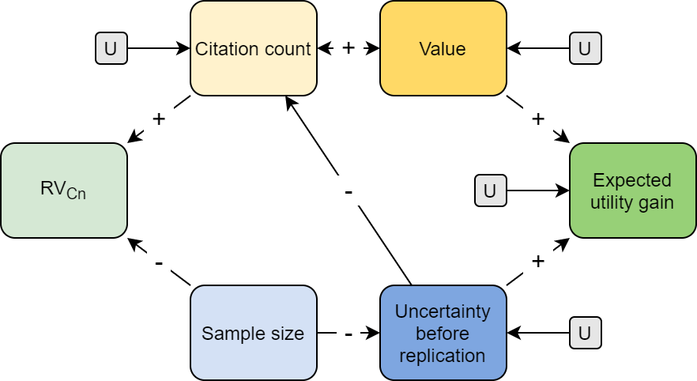

```{r setup, include = FALSE}
options(digits = 3)

library("papaja")
library(ggplot2)
library(gridExtra)
library(knitr)
library(viridis)
library(metR)

source("curate_science_study/RV_cursci_example.R")
```

```{r analysis-preferences}
# Seed for random number generation
set.seed(42)
knitr::opts_chunk$set(cache.extra = knitr::rand_seed)
```

# Introduction

After close to a century of repeated reminders that replication studies play an important role in establishing robust scientific knowledge, and following a number of high-profile replications published in the last decade [e.g., @OpenScienceCollaboration2015; @Ritchie2012; @Wagenmakers2016; @Ranehill2015; @Hagger2016], researchers from many scientific disciplines are increasingly calling for a renewed focus on replication research [@Zwaan2018; @Plucker2021; @Button2013; @Blaszczynski2019; @Heirene2021; @Sale2018; @Murphy2021]. Given the exponential growth of the empirical literature [@Bornmann2015; @Parolo2015] and the low rates of replication up until this point [@Makel2012; @Mueller-Langer2019], researchers interested in conducting replications of original research will often have to choose which of several replication targets to focus limited resources on. Similarly, funding bodies have to decide which of several proposed replication efforts to direct limited grant money towards, and journals that limit the number of articles they accept for publication might benefit from clearly communicating which replication studies will be accepted. Given that there will often be a large number of replication targets to choose from, and assuming we can distinguish which targets would be most useful to replicate, study selection strategies are needed that will allow stakeholders to transparently discuss and compare the need for replication of candidate targets. 

In response to this need, there has been an increasing interest in developing quantitative, indicator-based strategies for estimating which targets are most in need of replication [see @Isager2020 for a review]. Proposed quantitative strategies tend to focus on different indicators. @Field2019 base selection on Bayes Factors, @Makel2012 formulate a selection criterion based on number of citations, @Matiasz2018 devise a strategy based on the number of existing replications of the same target, and so on [see supplementary documents in @Isager2020 for additional examples]. Common to all such strategies is that they are all fundamentally measurement instruments. For a quantitative indicator-based strategy to make sense, there must exist some target attribute (e.g., “replication importance”) that is related to our replication goals, and that can be quantified in a meaningful way. Furthermore, we must assume that the observed indicator(s) of interest (Bayes factor, citation count, number of replications, etc.) is somehow a valid and accurate measure of the target attribute [@Borsboom2004].

So far there has been little formal analysis of the measurement assumptions underlying proposed study selection indicators. For any given indicator it is often not made explicit (1) what goal we are working towards, (2) how that goal is related to the target attribute we are trying to measure, and (3) how well we are able to measure that target attribute using the proposed indicator. This makes validation of proposed study selection strategies challenging; it is difficult to say whether a strategy works as intended if it is not first made clear how the strategy is intended to work. To examine the quality of a given indicator-based strategy, stakeholders must therefore specify the goal of replication, formalize how the goal can be achieved by selecting studies based on the target attribute(s), and specify the measurement model that connects the target attribute(s) to our measured indicator(s).

The aim of this article is to address the need for measurement models by demonstrating how important measurement assumptions could be worked out and reported for a particular quantitative indicator. We begin by clearly stating the goal we want our study selection strategy to achieve, and the target attribute relevant for achieving this goal [which has been worked out in a previous article; @Isager2020]. We then propose a quantitative indicator to measure the target attribute. As part of this process, we discuss the various assumptions that must be met for the indicator to work as intended, and we show how these assumptions lead to observational predictions that let us test the validity of the proposed indicator. We are not advocating that the indicator we propose should be used for study selection without further validation of its usefulness, nor are we claiming that it is superior to already proposed study selection strategies. 


# The target attribute of replication study selection.

The first step in working out the measurement assumptions of a replication study selection strategy is to clearly define the assumed goal of the replication effort. What are we trying to achieve that should lead us to prefer one replication target over another? Here, we build on the decision model of replication study selection proposed by @Isager2020. This model proposes that the ultimate goal of replication study selection is to select the replication target that, out of all targets considered, will yield the largest gain in expected utility if replicated. Under certain additional assumptions, *expected utility gain* can be approximated by *replication value* [*RV*; see @Isager2020 for a formal definition of the term and outline of important underlying assumptions]. Replication value is a function of the *value* of having accurate knowledge about a replication target claim, and our *uncertainty* about the truth status of the target claim before it is replicated:

\begin{equation} 
  \tag{1}
  RV=f(value, uncertainty)
  (\#eq:1)
\end{equation}

If we further define value as “value of being correct about the truth status of a claim”, and uncertainty as “the probability of being incorrect about the truth status of a claim”, then we can express replication value more concretely as the product of value and uncertainty:

\begin{equation} 
  \tag{2}
  RV=value\times uncertainty
  (\#eq:2)
\end{equation}

If we are not willing to define uncertainty in terms of probability, we would need a different function to relate value and uncertainty. In the remainder of this article we will assume the definitions of value and uncertainty stated above, and consequently assume that equation \@ref(eq:2) is an appropriate function for combining value and uncertainty into an expected utility estimate. Expected utility gain is thus our ultimate target attribute, and replication value is our proximate target attribute (under the assumption that expected utility gain can be satisfyingly approximated by equation 2).


# Defining relevant measurement properties.

To create an indicator that is useful for replication study selection, we must ensure that the indicator is valid for measuring the target attribute, and that it measures the target attribute in a reliable and unbiased way. To accurately estimate replication value stakeholders will thus need to find valid, reliable and unbiased operationalizations of value and uncertainty. Following @Isager2020a, we consider an indicator to be *valid* for measuring replication value if (a) the attribute replication value exists and (b) replication value is d-connected to the indicator [i.e., the two variables are joined by an unblocked path in the causal model that describes their true relationship; see fine point 6.1 in @Hernan2020]. 

Following the APA Dictionary of Psychology, we consider an indicator to be a *reliable* measure of replication value if quantitative estimates of replication value are free of random error [@zotero-3730]. For most measurement instruments, complete freedom from random error is unattainable, and reliability is thus a matter of degree. In practice, we will have to decide how reliable an indicator should be before we can use it for replication study selection.

We consider an indicator to be an *unbiased* measure of replication value if indicator rank-order estimates do not systematically diverge from the true rank-order difference in replication value between the claims being considered [@zotero-3728; @Isager2020]. It matters less whether absolute replication value is over/under-estimated by the same amount for all candidates in a set of replication targets, since only relative rank-order replication value within the set matters for answering “which of the candidates *in this set* would I increase expected utility the most by replicating?”. Like reliability, bias is a matter of degree.

The validity, reliability and bias of an indicator combine to form the measurement *quality* of the indicator [quality is often referred to as “validity” in practice, but that term refers to something more specific here; @Borsboom2004]. For an indicator of replication value to be useful for replication study selection, it must have high measurement quality. That is, it must be valid *and* reliable *and* unbiased^[Formally, we might say that a high-quality indicator implies high mutual information [@DeDeo2018] between expected utility gain, replication value, and the indicator we use to estimate replication value.].


# Operationalizing an indicator of replication value. 

Many replication value indicators have already been proposed. Of these, most focus exclusively on either the value- or the uncertainty-side of equation 2. Some suggested indicators take both value and uncertainty into account [@Isager2020, supplementary materials], but suffer from at least one of two problems. In some cases, indicators are operationalized in obviously problematic ways. For example, if an indicator uses p-values in their operationalization of uncertainty (e.g., https://osf.io/x73rk/) it is not possible to differentiate between ambiguous statistical evidence (high uncertainty) and strong evidence for the null [low uncertainty; @Field2019]. In other cases, indicators depend on information that is not easily available in practice (such as whether the claim studied is considered "surprising"; https://osf.io/v8nkd/). Indicators that are difficult to calculate will be difficult to use and to validate, since validation depends on our ability to collect data about the indicator. For these reasons we here propose a novel quantitative indicator of replication value rather than analyze an existing indicator. However, we emphasize that working out the goals and assumptions of already proposed indicators would also be a highly worthwhile exercise. 

We propose to operationalize the value of a claim as a function of the *citation count of the original paper in which the claim is reported*. We propose to operationalize the uncertainty of the claim before replication as a function of the *sample size of the replication target study (or studies)*. The operationalized indicator of replication value thus becomes:

\begin{equation} 
  \tag{3}
  \begin{split} 
  RV=value\times uncertainty \\
  \approx f(\textit{citation count}) \times f(\textit{sample size})
  \end{split}
  (\#eq:3)
\end{equation}

In what follows, we provide a rationale for the choice of this indicator, define the functions f(), and discuss known and potential issues related to validity, reliability and bias.


## Citation count as an indicator of value 

We define the value of a claim as the stakes involved in decision outcomes based on the claim. Suppose a mining company is considering whether to establish a new mine. Research suggests “there is gold in them there hills”. If the claim is *correct* and the company chooses to believe it, the new mine will turn a huge profit. If the claim is *false* and the company chooses to believe it, the mine will be a complete waste of resources. Thus, the value of the claim “there is gold in them there hills” depends on the interaction between the decisions we make based on the claim and the truth status of the claim, which will determine the decision outcome. In other words, value is the expected utility of being correct about the truth status of the claim (relative to the value of being wrong). Value is usually related to the impact of the claim in science and society. A claim may be impactful for many reasons. Scientific claims can be used to build theories and research lines, transform clinical treatment, guide education, inform public policy, etc. The potential benefits of such applications of scientific claims will depend on the truth status of the claim. Consider the claim “naltrexone is an effective treatment for drug craving”. If true, this could have a huge impact on addiction treatment policy. Because the stakes are high when applying this claim (e.g., the health and safety of drug dependent patients) the value of having accurate knowledge about the claim is high. Formally, we could treat value as a formative attribute constructed from multiple forms of impact. Whenever we state that a claim is valuable we usually mean that the claim has been impactful in one or several ways. Finding a valid measure of value thus entails operationalizing one or more of these impact attributes. Stakeholders can differ in how they operationalize these attributes, depending on what goal(s) they value.

Here we propose to focus on scientific impact, and operationalize impact in terms of citation count, which is generally considered a valid indicator of scientific impact [@Aksnes2019]. Scientific impact can be roughly defined as the impact of a claim on future research decisions (such as whether to run a follow-up study, build on a previous finding, etc.). If we can assume that researchers tend to cite articles as support for important research decisions, then citation count will be sensitive to variation in value that is caused by variation in scientific impact (figure \@ref(fig:1)). Based on comprehensive reviews of the literature on citation behavior [@Aksnes2019; @Bornmann2008] and empirical studies of the relationship between citation count and perceived scientific impact by researchers [@Ioannidis2014; @Radicchi2017], we consider this assumption to be plausible in many fields of science. By definition, it then follows that the number of citations of an article is a valid measure of the perceived value of the claims in that article [@Isager2020a].  Citation count also has several other desirable measurement properties. Its interpretation is relatively straight-forward. A meticulous record of citation count is kept by many bibliometric sources, which means that reliability of the count across sources can be studied [@Martin-Martin2018]. Bibliometric recordkeeping also means that citation counts can be obtained with little effort in any scientific discipline, which is crucial for being able to utilize citation count for study selection in practice.

![**Figure 1:** Proposed causal relationship between *value* and *citation count* (*citation count* is outlined by a square to signal it is observable). The figure can be interpreted as a directed acyclic graph model, where 'value' and 'citation count' are d-connected through 'scientific impact', and all other variables act as independent noise factors on this relationship. Yellow-colored variables represent those we want information about. Dashed circles represent variables d-separated from 'citation count', which we want to but do not have knowledge about. Since they are unmeasured causes of 'value' they also act as noise factors by distorting the relationship between *value' and *citation count*. Grey-colored variables represent noise factors that influence *citation count* but are d-separated from *value*. *Additional sources of impact* refer to any additional non-confounding causes of *value* that we could think of (the unmeasured attributes U traditionally used in causal graph models). Absence of a causal arrow between any two variables in the model implies the strong assumption that there is no causal relationship between these variables.  (\#fig:1)](figure_1.png)

However, citation count is clearly an imperfect indicator of value. First, citation count is not considered a very good measure of other sources of impact stakeholders value, such as societal or clinical impact. Impact on these dimensions is less likely to generate citations from articles published in scientific outlets listed in major bibliometric databases [@Aksnes2019; @Eck2013]. Consequently, a traditional citation count metric will likely not be sensitive to variation in value that is caused by variation in these dimensions of impact (see dashed circles in figure \@ref(fig:1)). When these other sources of impact are the most important to our overall definition of value, citation count is going to be a poor measure of value (which, by extension, will lead to poor estimates of replication value). 

Second, even in cases where scientific impact is of primary interest, articles are cited for a myriad different reasons that need not have anything to do with the scientific impact of claims put forward in them. Non-relevant influences on citation count include (but are not limited to) the time of publication, the bibliometric source that is doing the counting, arbitrary citation conventions within scientific fields, the language in which an article is written, reputation of article authors, preference for citing personal acquaintances, bandwagon effects, self-citations to increase academic standing, etc. [@Bornmann2008; @Aksnes2019]. To the extent that such factors are independent of article impact, they act as random noise factors that reduce the reliability of citation count for measuring scientific impact and value (see grey circles in figure \@ref(fig:1)). 

It is worthwhile to consider whether noise factors could be controlled to increase reliability of the measurement. In some cases this will be challenging. For example, while it might be possible to classify whether citations occured due to arbitrary citation conventions, citations would need to be manually classified for each replication target [though see @Nicholson2021 for an example of innovations in citation classification]. However, three common and substantial sources of noise could likely be corrected for or held constant to improve the reliability of citation counts for measuring impact; the age of the article [@Bornmann2008; @Wang2013], the source of the citation count [@Martin-Martin2018], and the research field the target claims are part of [@Waltman2013]. 

Replication can only increase the expected utility of research decisions that have not yet been made. Therefore, we specifically want to know the *future* scientific impact of a replication target. If citation impact is taken as an indicator of simultaneous scientific impact, it follows that what we are interested in is the *future* citation impact of a replication target article. Current total citation count of an article is a measure of past citation impact, but is likely predictive of future citation impact [@Wang2019]. However, *total* citation count is not a useful predictor of future citations as soon as we start comparing target articles across different publication years, as older articles have had more time to be cited. As an example, imagine two articles, A and B, that are both cited exactly 10 times every year. However, at the time of comparison study A is 3 years old and has a total citation count of 30, while study B is 9 years old and thus has a total citation count of 90. If we would use A and B’s total citation count as a linear predictor of their relative future citation count we will erroneously conclude that B will receive three times as many citations as A. It is therefore sensible to adjust the two totals for their respective ages and estimate the *yearly citation rate* (i.e. the slope, or the derivative) of article A and B when determining their replication value.

Here we propose to adjust for publication age by simply dividing citation count by the number of years since the article was published. That is, we operationalize the value of a claim as the *average citations per year* of the paper that claim was reported in. In practice this assumes that past average yearly citation rate is a good predictor of the future trajectory of citations per year. This adjustment method works well when the future citation trajectory is relatively constant and similar to the past citation trajectory. Figure \@ref(fig:2)A displays the 50-year citation trajectory for an imagined article. The yellow line shows the predicted citation trajectory based on summing the citations from the first 25 years (yellow bars) and dividing by the number of years. As expected, the prediction of the actual citation trajectory (grey line) is very accurate.

```{r 2, fig.cap = "**Figure 2:** Simulated 50 year citation rate for two imagined articles. The yellow bars display the citation rate for the first 25 years in the article’s history. The grey bars represent the future rate (year 26-50) that we want to predict. The yellow labeled line displays the predicted trajectory of future citations based on taking the sum of citations from the first 25 years and dividing by the number of years. **(A)** The true citation trajectory is defined as a constant citation count per year plus random error. The predicted trajectory is a very good approximation of the true citation rate. **(B)** The true citation trajectory is defined as a gamma function of the year since publication plus random error. The predicted trajectory substantially overestimates the true citation rate.", warning=FALSE}
source("figure_2.R")
```

Adjustment by averaging over age works less well when the citation trajectory of an article is not constant over time. Figure \@ref(fig:2)B displays a more realistic 50-year citation trajectory [@Parolo2015]. In this context, predicting the future trajectory based on past average yearly citation count leads to a considerable overestimate of future citations. In fact, average yearly citation count will systematically over- or underestimate the future citation trajectory whenever the trajectory is not converging towards the past average yearly citation count. We therefore recommend that, whenever possible, prediction of future citation impact should be based on more sophisticated prediction techniques that utilize the entire distribution of past citation rate and other bibliometric features of the target article [e.g., Chakraborty2014; @Yuan2018]^[Even detailed access to the past citation record of an article will not always allow for accurate prediction of future citation count however, due to phenomena such as “sleeping beauties” [Ke2015] and other hard-to-predict fluctuations in citation rate.]. However, these methods require advanced expertise to understand and implement, and the information required to implement them may not always be available. For now, we focus on the simpler method of averaging over article age, which provides a rough but useful method for adjusting citation impact estimates so replication targets of different ages can be compared. 

In addition to controlling for age, we also need to consider the source that the citation count estimate is derived from. Citation counts retrieved from different sources (such as Google Scholar, Crossref, Scopus or Web of Science) differ both in terms of their reference coverage and in their exact citation counts for the same reference [@Martin-Martin2018]. However, rank-order correlations between citation counts from different sources appear to be very high [@Martin-Martin2018; @Burgers2019]. Thus, as long as the same source is consistently used for all replication candidates under consideration, the relative rank-order difference in citation count between two candidates should be highly similar regardless of which source we use.

Finally, we need to consider the fact that article citation counts tend to systematically vary between research fields for reasons that have nothing to do with the value of claims [e.g., @Waltman2013; @Bornmann2008]. Two fields may differ in average article citation count due to differences in citation conventions, the amount of journals or issues published per year, word limits and the maximum number of references that is allowed for a specific article type, etc. A common approach to control for such variation is to replace raw citation count with *field-weighted citation impact* [FWCI; @Waltman2019], in which citations are normalized against the average citation count of articles from the same field of science. 

One prominent difficulty with FWCI is determining the reference class to normalize citation counts against. That is, when taking the average citation count of a research field, which articles in the literature belong to that field? While it is common to use Web of Science field categories for this delineation, these are considered too heterogeneous to accurately control for variations in citation practices [@Waltman2013]. Van Eck, Waltman, van Raan, Klautz, and Peul [-@VanEck2013] have demonstrated that FWCI fails to account for within-field variations in citations practices in medical science, and this can lead to a severe underestimation of the impact of clinical research. Another challenge when using FWCI to measure value is that some systematic differences in citation counts between fields may genuinely be due to differences in the value society places on knowledge produced in different fields. For example, according to Web of Science, the field of oncology (cancer research) is nearly four times the size of dermatology (skin condition research) in terms of sheer volume of articles published (1,802,676 vs 481,033 records, as of 2021-04-09) and at the time of writing, *CA: A Cancer Journal for Clinicians* is the highest impact factor journal in the world (292 as of 2019). If the research field of oncology contains more researchers than dermatology - leading to more papers getting published and more citations generated, on average, for each published paper - this could reflect the fact that research in oncology is, on average, considered more valuable than research in dermatology (to society, to clinicians, to the research community etc.). In this case, FWCI becomes problematic because it partly suppresses the association between citation impact and value. Researchers should think carefully about whether FWCI or raw citation count is more appropriate for estimating value given the goals of their replication effort, and should also consider whether some approaches to field-normalization are more appropriate than others [@Waltman2019]. 

With the above-mentioned issues in mind, if we are still willing to assume that scientific impact has a reasonably reliable causal effect on (age/source/field-corrected) citation count, and if we are willing to assume that scientific impact has a reasonably reliable causal effect on value, then citation count should be a useful measure of value. Based on these assumptions, we propose the following operationalization of value for the purposes of study selection:

\begin{equation} 
  \tag{4}
  value=\frac{w(C_{S})}{Y+1}
  (\#eq:4)
\end{equation}

where *C* stands for citation count of the article in which the claim in question is published, *w*() stands for the weighting function that should be applied to the citation count (a field normalization, a utility function, etc. If raw citation scores are used then no weighting function is applied to *C~S~*, $w(C_{S}) = C_{S}$, and *w*() can simply be removed from the equation), *S* denotes the source the citation count is retrieved from, and *Y* denotes the age of the article in years (1 is added to *Y* in order to prevent the equation from evaluating to infinity when the article was published less than a year ago and $Y=0$)^[Since all articles less than a year old will be adjusted by the same amount, an article published in January will be considered of the same age as an article published in December, even though the former has had many more months to acquire citations. This will likely matter less when both articles are several years old, but for young articles the monthly age difference may lead to substantial differences in their value estimates. If possible, instead of adding 1 to the citation estimate one could consider collecting the exact publication date of each article, treat each day as 1/365th of a year, and simply divide citations less than a year old by 1/365th times the number of days since publication.]. The Value of an article published less than a year ago simply equals the weighted citation count of the article ($w(C_{S}) \div (0+1)=w(C_{S})$), the Value of an article published one year ago equals half the weighted citation count of the article ($w(C_{S})\div(1+1)$), and so on. Thus, Value is not identical, but closely related to the average yearly (weighted) citation count of the article. 

We could substitute equation \@ref(eq:4) with a more intricate estimator and likely get a more accurate impact estimate [@Martin2011]. However, there is an effort/accuracy tradeoff involved in replication study selection. The benefits gained by more accurate estimates of value need to be worth the additional efforts expended in collecting those estimates [e.g., in reviewing documentation, interviewing key stakeholders, running case studies, etc; @Klautzer2011], since all effort could be avoided by simply choosing a replication candidate quickly based on random chance or personal interest, which would still lead to some expected utility gain. Consequently, it may be preferable to use a less accurate but more easily derivable operationalization of value, so long as that measure is still accurate enough to yield study selection decisions that increase utility more than random selection. 


## Sample size as an indicator of uncertainty

Uncertainty, like value, is a multi-determined attribute. We may be uncertain about a claim for a variety of reasons. The study design(s) used to test the claim may lack internal or external validity, we may have a high prior that counteracts existing research, statistical power might be too low to detect effect sizes of interest, original findings may not have been independently replicated (or independent replication has failed to reproduce the original study results), we may suspect that the evidence base is influenced by publication bias, selective reporting, p-hacking, or fraud, and so on. Many factors related to uncertainty could be quantified. For example, we can express our uncertainty about parameter estimates using confidence intervals or other variability indices, and we can express uncertainty about the relative likelihood of data given different hypotheses using likelihood ratios or Bayes factors. We could incorporate uncertainty due to publication bias into Bayesian prior beliefs, which we could then combine with data into informed posterior beliefs about claims. Alternatively, we could quantify uncertainty in terms of entropy using principles from information theory [@DeDeo2018]. If our uncertainty depends on results from multiple studies, we could combine their estimates through meta-analysis. The list goes on. However, the information required to compute informative Bayesian posteriors, Shannon entropy, etc., is often difficult to curate from published research reports, which makes the task of estimating uncertainty based on these indicators difficult in practice. To offer an indicator of uncertainty that is more easily derivable we here propose to estimate uncertainty about a claim via the sample size of the existing study (or studies) that investigate the claim. 

Establishing the validity of sample size for measuring uncertainty requires a small chain of measurement assumptions (figure \@ref(fig:3)). First, given a set of findings comprising the original and the replication literature, we propose to approximate uncertainty as the precision with which a parameter relevant to the claim has been estimated (e.g., for the claim “stretching reduces the risk of athletic injury” we might be interested in the precision of risk ratio estimates from relevant randomized controlled trials). Precision of parameter estimates is obviously only one factor that makes up our overall uncertainty about a claim [@Isager2020]. Even so, it seems reasonable to assume that (all else being equal) increasing precision of a parameter estimate also decreases the uncertainty about claims based on that parameter. Statistically we can define precision of the estimate as the standard error of the parameter estimate^[This definition of precision of the estimate will only make sense for quantitative parameters].

![**Figure 3:** Proposed causal relationship between ‘uncertainty’ and ‘sample size’ (‘sample size’ is outlined by a square to signal it is observable). The figure can be interpreted as a directed acyclic graph model, where ‘sample size’ has a causal effect on ‘uncertainty’ by reducing the ‘standard error’ of relevant parameter estimates. Dashed circles represent variables d-separated from ‘sample size’, which we want to but do not have knowledge about. Since they are unmeasured causes of ‘uncertainty’, dashed circles also act as noise factors distorting the relationship between ‘uncertainty’ and ‘sample size’. ‘Additional sources of uncertainty’ refer to any additional non-confounding causes of ‘uncertainty’ that we could think of (the unmeasured attributes U traditionally used in causal graph models). Absence of a causal arrow between any two variables in the model implies the strong assumption that there is no causal relationship between these variables.  (\#fig:3)](figure_3.png)

Second, when the standard deviation is not available we propose to make the assumption that it is constant across all replication candidates, and to subsequently estimate the precision of the estimate using only the sample size of the estimate. This assumption will obviously always be false to some extent, which will lead to reduced estimate reliability. However, it does capture the fact that, all else being equal, the higher the sample size the more precise the estimate. Based on the assumptions above, we propose the following equation for uncertainty:  

\begin{equation} 
  \tag{5}
  uncertainty=\frac{\sigma}{\sqrt{n}}=\sigma\frac{1}{\sqrt{n}}\propto\frac{1}{\sqrt{n}}
  (\#eq:5)
\end{equation}

where $\sigma$ is the standard deviation of the estimate, and *n* is the corresponding sample size (i.e. the number of participants). When $\sigma$ is constant, the equation is proportional to $1\div\sqrt{n}$. In other words, we assume that the standard deviation is the same for all replication targets compared, and we assume that no other variance components but participant variance are relevant to our standard error estimate [@Westfall2014]. When a claim depends on parameter estimates that have only been estimated in a single study, we can set *n* to the sample size of that study. When parameters have been estimated in multiple studies, we should set *n* to the total sample size over all studies (see [supplementary material 1](https://osf.io/rdhw3/) for a rationale and relevant equations). Equation 4 behaves in line with the definition of uncertainty given by [@Isager2020] whenever $n>0$.^[When $n=1$ it is not possible to estimate between-subject variance, so we should be maximally uncertain. When we are maximally uncertain, $uncertainty=1$, which is what equation 4 yields for $n=1$.]

A limitation of this operationalization of uncertainty is that it ignores several important factors that also contribute to uncertainty (dashed circles in figure \@ref(fig:3)). For example, we may be highly uncertain about a claim if the experiment used to support it is poorly designed, poorly conducted, or if the claim suggests that experimental effects can be generalized to a widely different context. This uncertainty may be completely independent of the sample size of the study. In addition, there are instances where participant sample size is not a strong determinant of the standard error. For example, participant sample size is a poor estimator of the standard error  in mixed model designs where the random effect of participants is low compared with other random factors, such as stimulus [@Westfall2014; @Rouder2018; @DeBruine2021]. The same happens in repeated measures designs where the number of repeated samples per participant can matter more than the number of participants per se, depending on the within-subject correlation (see [supplementary material 2](https://osf.io/pz5qa/) for a method of correcting the sample size estimate in such cases). In general, because sample size is a cause of uncertainty, all determinants of uncertainty that are independent of sample size will tend to reduce the reliability of sample size as a measure of uncertainty. This problem is mitigated in more complex uncertainty estimators such as Bayesian posteriors, which can incorporate several independent causes of uncertainty into the estimate.

However, there are also advantages to using sample size as a measure of uncertainty. Sample size contributes substantially to determining many of the previously mentioned factors that influence uncertainty, such as Bayesian posteriors, confidence/credible intervals, etc., without invoking particular statistical inference philosophy. Sample size is also very often readily available in published articles, regardless of the study design and statistical analysis methods used (which is not the case for other potential uncertainty estimators such as Bayesian posteriors). In summary, we believe sample size will be valid for estimating overall uncertainty in most circumstances, but the reliability of these estimates may be low due to the many independent factors influencing overall uncertainty. Reliability could always be improved by substituting sample size with the full standard error in equation 4, but this will require information that is not always available. To facilitate more efficient estimates of uncertainty it is important that researchers begin to share statistical information consistently and in machine-readable formats [@Lakens2021a]. 


## Replication value as a function of citation count and sample size

If we operationalize value and uncertainty as specified in equations \@ref(eq:4) and \@ref(eq:5) and assume the structural equation for replication value defined in @Isager2020 (equation \@ref(eq:2) in this article), we can construct a quantitative operationalization of replication value by multiplying equation \@ref(eq:4) (our value estimator) with \@ref(eq:5) (our uncertainty estimator), which yields the following operational definition of replication value:

\begin{equation} 
  \tag{6}
  RV_{Cn} = value\times uncertainty = \frac{w(C_{S})}{\sqrt{Y+1}}\times\frac{1}{\sqrt{n}}
  (\#eq:6)
\end{equation}

where RV~Cn~ denotes a particular operationalization of replication value in terms of citation count *C*, and participant sample size *n*, *w*() stands for the weighting function that should be applied to the citation count, *S* denotes the source the citation count is retrieved from, and *Y* stands for the age of the article in years. 

Figure \@ref(fig:4) represents the measurement model for RV~Cn~. It summarizes the causal assumptions that justify the use of RV~Cn~ as a measure of expected utility gain. Assuming that the casual relationships in the model holds, RV~Cn~ is d-connected with, and hence a valid measure of, expected utility gain. However, due to known unmeasured relationships (the U nodes in figure 4) RV~Cn~ can not be expected to be perfectly reliable. The exact reliability of RV~Cn~ is an important empirical question for future studies. Clearly, we must require a certain level of reliability in order to consider RV~Cn~ a *useful* measure of expected utility gain.

![**Figure 4:** Measurement model justifying the validity of *RV~Cn~* as a measure of *expected utility gain*. *RV~Cn~* is d-connected with *expected utility gain*, as required for valid measurement by the d-connection definition of validity (Isager, 2020). The causal relations *value* &#8594; *expected utility gain* and *uncertainty before replication* &#8594; *expected utility gain* represent a simplified version of the structural causal model defined in Isager et al., (2020). All relations *U* &#8594; represent sources of noise due to unmeasured variables, such as the noise factors contained in figure 1 and figure 3. Absence of a causal arrow between any two variables in the model implies the strong assumption that there is no causal relationship between these variables. (\#fig:4)](figure_4.png)

Figure \@ref(fig:5) displays the distribution of *RV~Cn~* over variations in the input parameters. *RV~Cn~* estimates increase as the average yearly citation rate increases. Conversely, *RV~Cn~*  estimates decrease as the sample size increases. The axes in figure 5 cover a limited range of all possible input parameter values, but the distribution of *RV~Cn~* remains similar for any range of input values. 

```{r 5, fig.cap = "**Figure 5:** Distribution of RV~Cn~ for a range of input parameters."}
source("figure_5.R")
```

In summary, *RV~Cn~* is an appropriate operationalization of replication value when the following assumptions are met:

1. The goal of replication is to maximize  expected utility gain for the claim(s) targeted for replication.
1. Replication value, as defined in @Isager2020 is a valid measure of the expected utility gain that a replication study would yield.
1. Equation \@ref(eq:4) is valid and sufficiently positively associated with the true value of the to-be-replicated claim.
1. Equation \@ref(eq:5) is valid and sufficiently positively associated with the true uncertainty about the to-be-replicated claim.
1. Equation \@ref(eq:2) remains an appropriate specification of equation \@ref(eq:1) when value is operationalized as equation \@ref(eq:4) and uncertainty is operationalized as equation \@ref(eq:5).

In situations where either of these assumptions is violated, *RV~Cn~* will cease to be a useful indicator of replication value. 


# General study selection strategy

Having provided the measurement rationale for *RV~Cn~*, we must now specify how *RV~Cn~* can be implemented in a study selection strategy. In line with recommendations by @Field2019, we propose a procedure for study selection that combines *RV~Cn~* with a more comprehensive evaluation of expected utility gain. In-depth evaluation allows for quality control and nuance during study selection. Given that multiple noise factors obscure the relationship between *RV~Cn~* and expected utility, a certain amount of quality control will likely always be beneficial. However, detailed evaluation is also time-consuming and difficult to conduct in a systematic and unbiased way. To maximize the accuracy of study selection while simultaneously minimizing the time spent on assessment, we propose a study selection procedure in which *RV~Cn~* is used to narrow down the full set of replication candidates to a smaller subset of targets that are likely to be the most worthwhile to replicate. A more detailed evaluation process can then be applied efficiently to the highest *RV~Cn~* candidates before a replication target is finally selected. Replication study selection thus follows a general four-step procedure, outlined in figure 6. 


First, a set of candidate replication targets is curated. This set should contain all claims that are relevant to our interests and expertise. Targets that cannot be replicated due to feasibility-constraints can be excluded from the initial candidate set for efficiency. For example, suppose we want to form an initial candidate set of all experimental studies on the psychoactive effects of cannabis in healthy human participants. Curation of this set could begin by extracting all empirical articles on the psychoactive effects of cannabis from a bibliometric database. Subsequently, non-experimental studies, studies in non-human populations, studies in patient populations, etc., could be pruned away until the remaining set of candidates matches our research interests and feasibility constraints. Second, *RV~Cn~* is calculated for all replication targets in the candidate set, so that replication targets can be rank-ordered relative to each other based on their *RV~Cn~* estimates. Third, a subset consisting of the highest *RV~Cn~* targets in our candidate set is selected for closer inspection. Assuming *RV~Cn~* is a valid estimator of expected utility gain, this should increase the probability that the studies evaluated further are those most likely to lead to high expected utility gain if replicated. We can then invest a more substantial amount of time collecting both qualitative and quantitative information about which studies in this subset would be most worth replicating. How this evaluation should proceed is a topic of discussion [@KNAW2018; @Field2019; @Pittelkow2020], and should probably be adapted depending on the goals of the stakeholder. However, the model put forth in @Isager2020 suggests that evaluation should always include some consideration of (1) the perceived value of the research claim, (2) uncertainty about the truth status of the claim prior to replication, (3) the ability of the planned replication study design to reduce uncertainty about the claim, and (4) the estimated costs of conducting the replication effort. Empirical research to explore this issue in further detail is currently underway [@Pittelkow2021]. Finally, the replication target that is considered the most promising after comprehensive evaluation is prioritized for replication. Alternatively, if detailed evaluation suggests no study in the subset would be worthwhile to replicate, step 3 can be repeated until a suitable target is found. 

# Preliminary validation of *RV~Cn~*: assessing the replication value of replicated studies.

Whether *RV~Cn~* is a valid and high-quality estimator of expected utility gain is an empirical question. Validation of replication value indicators will be challenging, since there does not exist an observable ground-truth measure of expected utility gain to benchmark indicators against. However, under some additional assumptions it is possible to make statements about what we expect to observe if *RV~Cn~* works as intended. For example, if the true expected utility gain associated with a claim makes it more likely that researchers will select that claim for replication, then *RV~Cn~* estimates and researchers' selection preferences should be correlated under the causal model: *RV~Cn~* &#8592; *expected utility gain* &#8594; *selected by researchers for replication*. Consequently, studies that have been replicated should have a higher *RV~Cn~* on average than non-replicated empirical studies from the same discipline. We here provide preliminary validation of this predicted difference in a set of empirical articles from the field of psychology. 


## Methods

### Samples

We collected one dataset intended to represent the population of replicated studies in psychology, and one dataset intended to represent the general population of empirical studies in psychology. 

The sample of replicated studies consisted of original study articles listed in the Curate Science replication dataset (https://curatescience.org/app/replications). As of 2020-10-20, the Curate Science replication dataset contained information about `r cr_numberofreps` replications of `r cr_numberoforiginals` original studies, primarily from the field of psychology. For these original studies we estimated *RV~Cn~* using sample size information available in the Curate Science dataset, and using publication year and citation count information from Crossref [https://www.crossref.org/. Citation counts were extracted from crossref 2020-10-20 using the rcrossref package in R; @Chamberlain2020]. Due to missing DOI information, *RV~Cn~* could not be calculated for `r cr_numberoforiginals-cs.RV.n` studies. The final sample of replicated studies contained `r cs.RV.n` studies from `r cs.c.n` articles. 

The comparison sample consisted of `r pbul_numberofstudies` empirical studies referenced in the tables of meta-analyses published in Psychological Bulletin between the years 1914 and 2017. Since all articles contained findings that have been referenced in meta-analysis tables in a general-topic psychology journal, we assumed this sampling strategy would form a reasonably representative sample of published empirical psychology studies. We also assumed, given the generally low rate of replication in psychology [@Makel2012], that the comparison sample would consist largely of non-replicated original studies. We estimated *RV~Cn~* for each article using the sample size available in the meta-analysis tables, and using publication year and citation count information from Crossref (citation counts were extracted from crossref 2020-10-20). To retrieve citation count information, the DOI of each study had to be retrieved, which was accomplished by applying a text-mining procedure to the bibliometric information available in the meta-analysis tables and reference lists. However, limited bibliometric information in the meta-analysis tables led to many cases where the DOI could not be retrieved. Due to missing DOI information, *RV~Cn~* could not be calculated for `r pbul_numberofstudies-pbul.RV.n` studies. The final sample of replicated studies contained `r pbul.RV.n` studies from as many articles. \

### Statistical analyses

Our main hypothesis was that average *RV~Cn~* would be higher in the sample of replicated studies than in the comparison sample. In addition, we analysed differences between samples in citation count, average citations per year, and sample size, to better understand the causes of any potential differences in *RV~Cn~* between the two groups. Because all variables of interest were highly skewed, non-parametric methods were used for all analyses. Median value and interquartile range were calculated in both samples for each variable of interest. To compare differences between samples, we calculated Vargha and Delaney's A for each variable of interest, which represents the probability that a random observation from the sample of replicated studies has a higher value than a random observation from the sample of non-replicated studies [@Vargha2000]. Bootstrapped 99% confidence intervals are reported for each effect size A. Analyses were not preregistered.

The data files and analysis script used to generate all results reported below are openly available on OSF (https://osf.io/e35pu/).


## Results

Statistical results are presented in table \@ref(tab:tab1). Cube-root transformed distributions of the variables of interest are presented in figure \@ref(fig:7). *RV~Cn~* was, on average, substantially greater in the sample of replicated studies than in the comparison sample (figure \@ref(fig:7)D). This difference seemed to be driven both by differences in citations per year, and by differences in sample size. Replicated studies received a greater number of citations (figure \@ref(fig:7)A), even after adjusting for article age (figure \@ref(fig:7)B). Conversely, replicated studies had substantially lower sample size, on average (figure \@ref(fig:7)C).

```{r tab1}
apa_table(summary.tab, caption = "\\textbf{Table 1:} Summary statistics for variables of interest in the replicated (Curate Science) and comparison (Psychological Bulletin) samples.", escape = F)
```

```{r 7, fig.env='figure*', fig.cap = "\\textbf{Figure 7:} Distributions of various parameters in the comparison sample of psychological findings (red) and the sample of replicated findings in psychology (blue). The scale in all plots has been transformed by taking the cube root of the true values, which preserves the overall shape of the distribution but compresses the scale towards 1. \\textbf{(A)} Distribution of citation counts. \\textbf{(B)} Distribution of average citations per year. \\textbf{(C)} Distribution of sample size. The x-axis limit is set to 8000, which excludes less than 1 percent of data points. \\textbf{(D)} Distribution of \\textit{RV\\textsubscript{Cn}} replication value estimates."}
plot(p.all)
```

The patterns reported above are what we would expect to see if (1) researchers tend to follow the model of @Isager2020 when selecting studies to replicate, (2) researchers can reliably predict the expected utility of replication efforts, and (3) *RV~Cn~* is a valid but somewhat unreliable predictor of the expected utility of replication efforts. Under these assumptions, a higher *RV~Cn~* for replicated studies constitutes evidence for convergent validity between researchers' selection decisions and *RV~Cn~*. Whether these assumptions truly hold, and whether there are other assumptions that would lead to the same predicted correlation without implying valid measurement, are still unresolved issues. Readers should therefore consider these results preliminary evidence for the validity of *RV~Cn~*. 

Our design is limited in a number of ways. The citation data used for these analyses was collected in 2020 - years after the decisions to replicate were made. It is unclear what effects this delay may have. In addition, our comparison sample consisted entirely of empirical studies that are included in meta-analyses, which might differ from empirical studies that are not in several aspects, including citation count and sample size. Furthermore, *RV~Cn~* could not be computed for a majority of the comparison sample due to missing DOI information, and cases may not be missing at random. Thus, the representativeness of the comparison sample could be questioned. An alternative method for deriving a comparison group would be to count citations of studies from the date each study was selected for replication and select matched non-replicated controls from the same year and research field. Finally, the external validity of the sample of replicated studies may be reduced due to overrepresentation of a few large replication efforts. As one example, a large proportion of the studies included in the Curate Science dataset were replicated as part of the Reproducibility Project: Psychology [@OpenScienceCollaboration2015]. All studies replicated as part of this effort used the same general study selection procedure (see https://osf.io/ezrsc/ for details about the sampling strategy). 

A more fundamental limitation of this validation effort is the relatively low severity of the conclusions [@Mayo2018]. In effect, these data are weak falsifiers of the construct validity of *RV~Cn~*. Consider what would have happened if the data showed no difference in replication value between the two samples. Would this have suggested that *RV~Cn~* is a poor measure of replication value? Or would it have suggested that replication value is a poor measure of expected utility gain? Or would it have suggested that researchers' decisions of what to replicate is a poor measure of expected utility gain? Perhaps *RV~Cn~* is a better measure of expected utility than researchers are? Conversely, a correlation between researchers’ study selection decisions and *RV~Cn~* does not necessarily mean that either is a valid measure of replication value. Perhaps both are consistently measuring a different construct than the one we are interested in. The data presented here do not let us resolve these issues, so they cannot definitely corroborate the validity of *RV~Cn~*. Severity is also lowered by the fact that these were exploratory analyses conducted by the same researchers who proposed the model the data are trying to falsify. Preregistered independent replication of these results in new data are therefore needed. 


# General discussion

To develop any strategy for efficient replication study selection, we need to (1) specify the goal we are trying to achieve, (2) specify how this goal is realized by the strategy we are proposing, and (3) empirically validate that the proposed strategy works as intended. These three steps must be addressed in sequential order. We cannot specify how a given strategy achieves a goal without first specifying the goal, and we cannot validate whether a strategy works as intended before we can specify how the strategy is intended to work. @Isager2020 address the first of these steps. In this article, we have focused on the second. Given the goal of maximizing expected utility gain (and the assumption that this attribute can be approximated by replication value) we have formalized an observable indicator - *RV~Cn~*. We have formally specified the assumptions under which study selection based on *RV~Cn~* will maximize expected utility gain, and we have discussed a number of obfuscating factors that limit the usefulness of *RV~Cn~*. 

To our knowledge, *RV~Cn~* is the first replication study selection indicator that is explicitly treated as a measurement instrument. All indicators used for study selection are fundamentally measurement instruments, but *RV~Cn~* is currently the only indicator for which a formal measurement model exists. By extension, *RV~Cn~* is currently the only indicator whose validity could be strictly falsified. *RV~Cn~* is also the first indicator to incorporate information about both value and uncertainty, which is important whenever the goal of selection is to maximize expected utility gain. Should *RV~Cn~* be a valid and reliable measure of expected utility gain, it holds enormous potential for improving the transparency and efficiency of resource allocation in replication research. The indicator could be utilized by any researcher, funder, journal, or other stakeholder who wishes to direct limited resources towards important replication targets. Because calculation only requires information about citation impact and sample size *RV~Cn~* should be applicable for study selection across a variety of scientific disciplines. The strong measurement rationale on which *RV~Cn~* is built also makes it possible to improve and adapt the indicator to different contexts. For example, in disciplines where sample size is a poor measure of parameter estimate precision we can immediately see why *RV~Cn~* estimates would be unreliable (assumptions underlying equation \@ref(eq:5) are violated) and what remedy is required (replacing equation \@ref(eq:5) with a valid measure of precision). 

Three outstanding problems must be solved before we could confidently use *RV~Cn~* for study selection in practice. These problems concern the feasibility, validity, and the overall quality of *RV~Cn~* as a measurement instrument. We conclude this article with a brief sketch of each problem in turn.

First, in order to study the validity and usefulness of a study selection strategy based on *RV~Cn~*, we need to know whether the strategy is feasible to apply in practice. Feasibility depends on a number of factors, including how difficult it is to assemble an initial pool of replication candidates and how difficult it will be to obtain the citation count and sample size of each candidate in the pool. Fortunately, obtaining citation counts will likely be a simple task regardless of the number of candidates, since records of such information are kept by multiple bibliometric services (e.g., Crossref, Scopus, and Web of Science), and can be automatically extracted for free through API interfaces such as the rcrossref package in R [@Chamberlain2020]. Collecting sample size information will likely be more difficult. While sample size is almost always reported for empirical studies, it will likely have to be obtained manually for each replication target, and issues related to participant exclusion and multiple samples (e.g., when standard errors depend heavily on both the number of participants and stimuli sampled) will have to be reckoned with. In a forthcoming paper, we will explore the feasibility of applying a study selection procedure based on *RV~Cn~* within the context of fMRI research in social neuroscience. Similar studies will likely be needed in other areas in which *RV~Cn~* is to be applied.

Second, provided it is feasible to collect data about *RV~Cn~* it must then be rigorously validated. That is, we must empirically corroborate that *RV~Cn~* is sensitive to variation in the actual expected utility gained from replication efforts. The lack of high-quality indicators of expected utility gain prevents straight-forward benchmarking. As a substitute we could attempt to identify plausible indicators of expected utility gain and compare *RV~Cn~* to these, like is done in the study reported above. However, interpretation of results will be less straight-forward in such studies because we must add the auxiliary assumption that whatever attribute we compare *RV~Cn~* with is itself a good measure of expected utility gain [@Meehl1997]. Alternatively, *RV~Cn~* could be validated by corroborating the individual assumptions it is built on. The constituent causal hypotheses in the chain that leads *RV~Cn~* estimates to be a valid measure of expected utility gain (figure \@ref(fig:4)) could be separated and tested in isolation. In principle, falsifying any single causal assumption would falsify the validity of *RV~Cn~* overall, since valid measurement requires that all the causal relationships hold. Finally, instead of examining the validity of *RV~Cn~* in isolation we could train machine-learning algorithms to predict indicators of expected utility gain based on a broad range of bibliometric and statistical information, as has recently been done to understand predictors of research *replicability* [@Altmejd2019; @Yang2020]. This should yield a better understanding of the predictive power of citation impact and sample size relative to other types of information we could be considering. 

Third, even if *RV~Cn~* would be valid for measuring expected utility gain we still need to consider the broader issue of overall measurement quality [@Borsboom2004]. That is, we need to empirically examine whether *RV~Cn~* is sufficiently reliable and unbiased. If we accept the causal hypotheses outlined in figure \@ref(fig:4), then by definition replication *RV~Cn~* must be somewhat unreliable due to the influence of unmeasured noise factors U in the measurement process. The influence of the various noise factors will likely depend on the diversity of the candidate set we are considering. Consider a set of studies, all from the same subfield, all published within the span of a few years, and all utilizing similar study designs. Now compare this to a set consisting of replication candidates from across a wide time-span and many scientific fields, studying a wide range of topics with widely different study designs. Variation in the noise factors included in figure \@ref(fig:1) and figure \@ref(fig:3) will likely be much higher in the latter set than in the former. Thus, the reliability of *RV~Cn~* will likely decrease as the diversity of replication targets increases, and there might even be a limit to how broadly we can apply and compare *RV~Cn~* estimates without compromising measurement reliability entirely.

*RV~Cn~* could also easily be a biased measure of expected utility gain. As an example, consider the possibility that researchers prefer to cite articles that provide strong support for the claims tested within (i.e., citation count is reduced by uncertainty about the claims). In this scenario, *RV~Cn~* would consistently underestimate expected utility gain since uncertainty ends up suppressing the positive effect of citation count on *RV~Cn~* estimates (figure \@ref(fig:8)). Similarly, overestimation of expected utility gain can happen if research which we are more certain will *not* replicate tends to get cited more often. Recent research indicates the latter situation might often be the case [@Serra-Garcia2021]. Note that we could in principle repeat this thought experiment for any two variables in figure \@ref(fig:4) not already joined by a causal arrow. Whenever the causal relationship implied by such an arrow seems plausible and causes systematic differences between the values of *RV~Cn~* and expected utility gain, we should be worried about bias in the measurement. 



The key insight we wish to leave the reader with in this paper is that *any* strategy for replication study selection must be able to demonstrate usefulness, which entails assessing the feasibility and quality of the study selection criteria used. This assessment can only happen if we first specify the goal of replication and formalize how the goal is achieved through the selection strategy we are proposing. Only then can we evaluate whether the strategy works as intended. For existing indicator-based strategies where the rationale behind the indicator used remains unclear [e.g., @Makel2012; @Field2019; @Isager2018; @Isager2020, supplementary materials], the measurement model should be formalized so that validation and comparison of different strategies can take place. The present article serves as a general example of how study selection strategies could explicitly be related to the goal we wish to accomplish when replicating, and how this in turn enables us to examine whether a given strategy is likely to work as intended. In doing so we enable a more transparent discussion of what is important to replicate, which will be crucial for coordinating future replication efforts and direct resources to where they are needed the most. Through such discussion and coordination we increase the overall impact of replication studies on scientific discourse and strengthen the argument for why replications should be conducted and rewarded. 


# References


